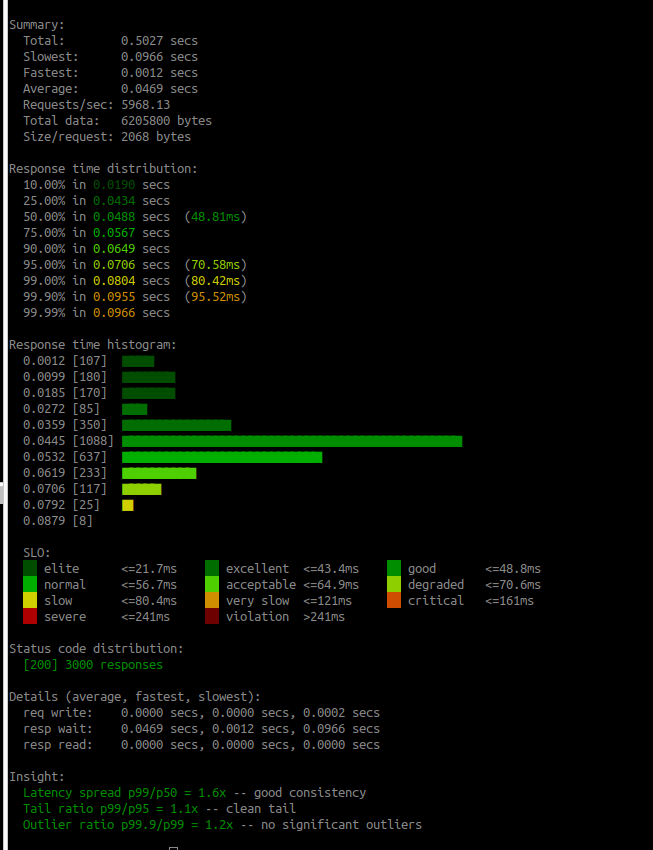
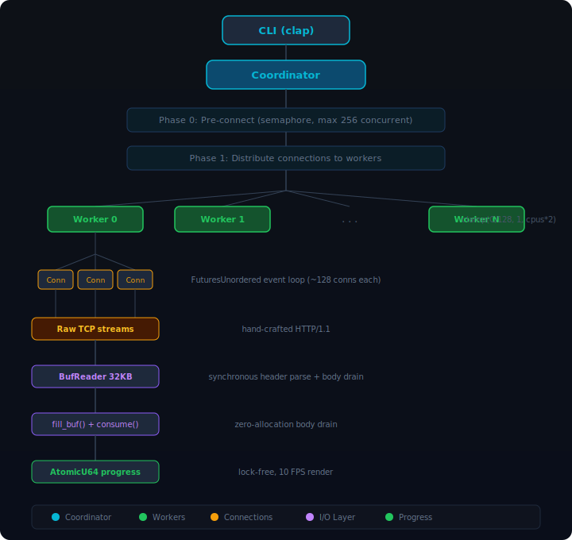

# vastar

HTTP load generator. Fast, zero-copy, Rust. Alternative to hey, oha, wrk.

```
$ vastar -n 3000 -c 300 -m POST -T "application/json" \
    -d '{"prompt":"bench"}' http://localhost:3081/api/gw/trigger

Summary:
  Total:        0.5027 secs
  Slowest:      0.0966 secs
  Fastest:      0.0012 secs
  Average:      0.0469 secs
  Requests/sec: 5968.13
  Total data:   6205800 bytes
  Size/request: 2068 bytes

Response time distribution:
  10.00% in 0.0190 secs
  25.00% in 0.0434 secs
  50.00% in 0.0488 secs  (48.81ms)
  75.00% in 0.0567 secs
  90.00% in 0.0649 secs
  95.00% in 0.0706 secs  (70.58ms)
  99.00% in 0.0804 secs  (80.42ms)
  99.90% in 0.0955 secs  (95.52ms)
  99.99% in 0.0966 secs

Response time histogram:        (11-level SLO color gradient)
  0.0012 [107]  ■■
  0.0099 [180]  ■■■
  0.0185 [170]  ■■■
  0.0272 [85]   ■
  0.0359 [350]  ■■■■■■
  0.0445 [1088] ■■■■■■■■■■■■■■■■■■■■■■■■■■■■■■■■■■■■■■■■■■■■■■■■
  0.0532 [637]  ■■■■■■■■■■■■■■■■■■■■■■■■■■■■
  0.0619 [233]  ■■■■■■■■■■
  0.0706 [117]  ■■■■■
  0.0792 [25]   ■
  0.0879 [8]

  SLO:
  ██ elite      <=21.7ms    ██ excellent  <=43.4ms    ██ good       <=48.8ms
  ██ normal     <=56.7ms    ██ acceptable <=64.9ms    ██ degraded   <=70.6ms
  ██ slow       <=80.4ms    ██ very slow  <=121ms     ██ critical   <=161ms
  ██ severe     <=241ms     ██ violation  >241ms

Status code distribution:
  [200] 3000 responses

Details (average, fastest, slowest):
  req write:    0.0000 secs, 0.0000 secs, 0.0002 secs
  resp wait:    0.0469 secs, 0.0012 secs, 0.0966 secs
  resp read:    0.0000 secs, 0.0000 secs, 0.0000 secs

Insight:
  Latency spread p99/p50 = 1.6x -- good consistency
  Tail ratio p99/p95 = 1.1x -- clean tail
  Outlier ratio p99.9/p99 = 1.2x -- no significant outliers
```

*With SLO color gradient (dark green → red):*



## Why vastar

|  | vastar | hey | oha |
|---|---|---|---|
| Language | Rust (raw TCP) | Go | Rust (hyper) |
| Binary | **1.2 MB** | 9 MB | 20 MB |

### Throughput (0B payload, requests/sec)

| Concurrency | vastar | hey | oha | Winner |
|---|---|---|---|---|
| c=1 | **93,192** | 40,942 | 71,750 | vastar 2.3x vs hey |
| c=10 | 226,650 | 145,607 | **320,712** | oha |
| c=200 | 220,311 | 132,650 | **240,421** | oha |
| c=500 | **408,117** | 71,695 | 234,676 | vastar 1.7x vs oha |
| c=1,000 | **536,758** | 106,861 | 18,329 | vastar 5x vs hey |
| c=5,000 | **372,191** | 64,443 | 14,196 | vastar 5.8x vs hey |
| c=10,000 | **336,700** | 61,427 | 38,141 | vastar 5.5x vs hey |

### Throughput (100KB payload, requests/sec)

| Concurrency | vastar | hey | oha | Winner |
|---|---|---|---|---|
| c=1 | **40,406** | 20,927 | 30,982 | vastar 1.9x vs hey |
| c=10 | 89,683 | 74,310 | **133,387** | oha |
| c=100 | 74,229 | 70,411 | **81,466** | oha |
| c=200 | 69,080 | **74,962** | 68,332 | hey |
| c=500 | **96,809** | 65,999 | 56,798 | vastar 1.5x vs hey |
| c=1,000 | **89,545** | 57,265 | 18,017 | vastar 1.6x vs hey |
| c=10,000 | **75,224** | 38,281 | 23,113 | vastar 2x vs hey |

oha dominates at c=10-200 with large payloads thanks to hyper's optimized connection pool. hey wins at c=200/100KB. vastar pulls ahead again at c=500+.

### Memory (0B payload, Peak RSS)

| Concurrency | vastar | hey | oha |
|---|---|---|---|
| c=1 | **4 MB** | 13 MB | 15 MB |
| c=1,000 | **32 MB** | 80 MB | 41 MB |
| c=10,000 | **284 MB** | 492 MB | 212 MB |

vastar uses 2-5x less memory than hey across all levels. At c=10,000 with 100KB payload: vastar 329 MB vs oha 1,477 MB.

See [BENCHMARK.md](BENCHMARK.md) for full comparison across 10 concurrency levels and 4 payload sizes.

## Features

- **11-level SLO color histogram** — ANSI 256-color gradient (dark green to dark red) mapped to percentile thresholds
- **Automated Insight** — latency spread, tail ratio, outlier detection from p50/p95/p99/p99.9
- **Key percentile highlights** — p50, p95, p99, p99.9 annotated with colored (ms) values
- **Phase timing Details** — req write, resp wait, resp read breakdown (like hey)
- **Live progress bar** — ASCII-only, terminal-aware, no emoji, no aggressive clear screen
- **Chunked transfer** — supports Content-Length and Transfer-Encoding: chunked (SSE/streaming)

## Install

```bash
# One-line install (Linux/macOS, auto-detects platform)
curl -sSf https://raw.githubusercontent.com/Vastar-AI/vastar/main/install.sh | sh

# Or via Cargo
cargo install vastar

# Or via Homebrew
brew tap Vastar-AI/tap && brew install vastar
```

Or build from source:

```bash
git clone https://github.com/Vastar-AI/vastar.git
cd vastar
cargo build --release
# Binary at ./target/release/vastar (1.2 MB)
```

## Usage

```
Usage: vastar [OPTIONS] <URL>

Options:
  -n <REQUESTS>              Number of requests [default: 200]
  -c <CONCURRENCY>           Concurrent workers [default: 50]
  -z <DURATION>              Duration (e.g. 10s, 1m). Overrides -n
  -q <QPS>                   Rate limit per worker [default: 0]
  -m <METHOD>                HTTP method [default: GET]
  -d <BODY>                  Request body
  -D <BODY_FILE>             Request body from file
  -T <CONTENT_TYPE>          Content-Type [default: text/html]
  -H <HEADER>                Custom header (repeatable)
  -t <TIMEOUT>               Timeout in seconds [default: 20]
  -A <ACCEPT>                Accept header
  -a <AUTH>                  Basic auth (user:pass)
      --disable-keepalive    Disable keep-alive
      --disable-compression  Disable compression
      --disable-redirects    Disable redirects
  -h, --help                 Print help
  -V, --version              Print version
```

## Examples

```bash
# Simple GET
vastar http://localhost:8080/

# POST with JSON body
vastar -m POST -T "application/json" -d '{"key":"value"}' http://localhost:8080/api

# 10000 requests, 500 concurrent
vastar -n 10000 -c 500 http://localhost:8080/

# Duration mode: run for 30 seconds
vastar -z 30s -c 200 http://localhost:8080/

# Custom headers
vastar -H "Authorization: Bearer token" -H "X-Custom: value" http://localhost:8080/

# Basic auth
vastar -a user:pass http://localhost:8080/

# Body from file
vastar -m POST -T "application/json" -D payload.json http://localhost:8080/api
```

## Architecture



### How it works

1. **Pre-connect phase.** All C connections are established in parallel before the benchmark starts. A semaphore limits to 256 concurrent connects to avoid TCP backlog overflow.

2. **Adaptive worker topology.** Workers scale as `clamp(C/128, 1, cpus*2)`. At c=50 that's 1 worker. At c=500 that's 4 workers. At c=5000 that's 32 workers (capped at cpus*2). Each worker runs a FuturesUnordered event loop managing ~128 connections. The tokio scheduler sees N workers (not C tasks) — drastically less scheduling overhead at high concurrency.

3. **Raw TCP request.** HTTP/1.1 request bytes are pre-built once at startup (`method + path + headers + body`). Each request is a single `write_all()` of pre-built `Bytes` (Arc-backed, zero-copy clone). No per-request allocation, no header map construction, no URI parsing.

4. **Synchronous response parsing.** One `fill_buf()` call gets data into BufReader's 32KB buffer. Headers are parsed synchronously from buffered data (find `\r\n\r\n`, scan for `Content-Length`/`Transfer-Encoding`). Body is drained via `fill_buf()` + `consume()` — no per-response allocation. Chunked transfer encoding is handled inline.

5. **Phase timing.** Each request measures write time, wait-for-first-byte time, and read time separately. These are accumulated per-worker (sum/min/max) and merged once at the end — no per-request timing allocation.

6. **SLO color histogram.** 11 histogram buckets mapped to 11 ANSI 256-color levels via the color cube path: `(0,1,0)→(0,4,0)→(1,5,0)→(5,5,0)→(5,1,0)→(4,0,0)→(2,0,0)` (dark green through yellow to dark red). Color only emitted when stdout is a terminal.

## Dependencies

```
tokio         — async runtime
bytes         — zero-copy buffers
clap          — CLI parsing
futures-util  — FuturesUnordered for connection multiplexing
```

4 crates. No HTTP framework. No TUI framework.

## License

MIT OR Apache-2.0
